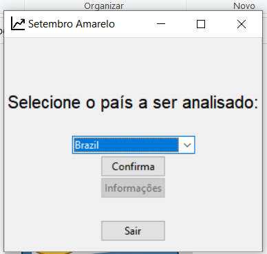

# Analise Dados Amarelo em Python

Trabalho criado para a disciplina de Algoritmos e Programação 2, em Python, onde dados, que vieram do Kaggle, são analisados de acordo com as configurações do usuário.

//Imagem 1:
//

Imagem 2:

Imagem 3:

